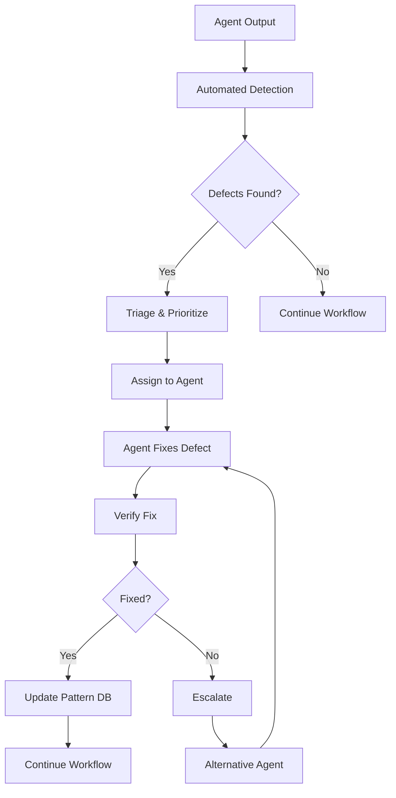

# ORCHESTRATION SYSTEM - COMPLETE TODO LIST

## ✅ Completed Items
1. ✅ Created Total Workflow Orchestrator for ALL agents (not just QA)
2. ✅ Implemented dynamic agent registry (not hardcoded to 34)
3. ✅ Added flexible team management system
4. ✅ Created self-learning system that improves with each PRD
5. ✅ Added agent achievement verification
6. ✅ Implemented 8-phase orchestration workflow
7. ✅ Added legal agents (legal-counsel, compliance-officer)
8. ✅ Created pure orchestration roadmap (removed trading platform references)

## 📋 Active TODOs

### 1. Core System Improvements
- [ ] Make agent count completely dynamic (no hardcoded numbers anywhere)
- [ ] Add runtime agent addition/removal capability
- [ ] Create team modification API
- [ ] Remove all trading platform specific code
- [ ] Clean up non-orchestration files from project

### 2. Bug/Defect Resolution System
- [ ] Implement automated bug detection during orchestration
- [ ] Create defect triage and assignment system
- [ ] Add automatic rework triggers for failed validations
- [ ] Implement bug pattern recognition and prevention

### 3. Legal & Compliance Integration
- [ ] Add legal review to Phase 3 (Security & Infrastructure)
- [ ] Create legal agent team with multiple specialists
- [ ] Implement compliance verification workflow
- [ ] Add regulatory requirement tracking

### 4. System Flexibility
- [ ] Remove hardcoded phase numbers
- [ ] Make workflow phases configurable
- [ ] Add custom workflow creation capability
- [ ] Implement workflow templates

### 5. Performance & Optimization
- [ ] Implement 70% token reduction
- [ ] Add smart caching system
- [ ] Create batch processing for parallel agents
- [ ] Optimize message passing between agents

### 6. Learning System Enhancements
- [ ] Add cross-PRD pattern recognition
- [ ] Implement predictive failure detection
- [ ] Create agent performance scoring
- [ ] Add automatic workflow optimization

### 7. Monitoring & Observability
- [ ] Create real-time orchestration dashboard
- [ ] Add agent performance metrics
- [ ] Implement cost tracking per agent
- [ ] Create audit trail for all operations

### 8. Documentation & Cleanup
- [ ] Remove all trading-specific documentation
- [ ] Create pure orchestration docs
- [ ] Add API documentation
- [ ] Create plugin development guide

---

## 🐛 BUG/DEFECT RESOLUTION SYSTEM

### Overview
The orchestration system needs built-in bug detection, triage, and resolution capabilities that work automatically during the development lifecycle.

### Implementation Design

```javascript
class DefectResolutionSystem {
  constructor() {
    this.defectQueue = new PriorityQueue()
    this.patterns = new DefectPatternDatabase()
    this.resolutionHistory = new Map()
  }

  // Phase 1: Detection
  async detectDefects(agentOutput) {
    const defects = []
    
    // Automated detection methods
    defects.push(...await this.runStaticAnalysis(agentOutput))
    defects.push(...await this.runUnitTests(agentOutput))
    defects.push(...await this.crossAgentValidation(agentOutput))
    defects.push(...await this.patternMatching(agentOutput))
    
    return defects
  }

  // Phase 2: Triage
  async triageDefect(defect) {
    const severity = this.calculateSeverity(defect)
    const responsibleAgent = this.identifyResponsibleAgent(defect)
    const similarDefects = this.patterns.findSimilar(defect)
    
    return {
      id: generateId(),
      defect,
      severity, // P0, P1, P2, P3
      assignedTo: responsibleAgent,
      suggestedFix: this.getSuggestedFix(similarDefects),
      deadline: this.calculateDeadline(severity)
    }
  }

  // Phase 3: Assignment & Resolution
  async resolveDefect(triagedDefect) {
    const agent = triagedDefect.assignedTo
    
    const resolutionPrompt = `
      You previously created code with the following defect:
      ${JSON.stringify(triagedDefect.defect)}
      
      Suggested fix: ${triagedDefect.suggestedFix}
      Similar defects resolved: ${triagedDefect.similarResolutions}
      
      Please fix this immediately and provide the corrected output.
    `
    
    const resolution = await invokeAgent(agent, resolutionPrompt)
    
    // Verify the fix
    const verificationResult = await this.verifyResolution(resolution, triagedDefect)
    
    if (!verificationResult.success) {
      // Escalate or try alternative agent
      return this.escalateDefect(triagedDefect)
    }
    
    // Learn from the resolution
    this.patterns.addResolution(triagedDefect, resolution)
    
    return resolution
  }

  // Phase 4: Prevention
  async preventFutureDefects() {
    const commonPatterns = this.patterns.getMostCommon()
    
    // Update agent prompts with prevention guidelines
    for (const [agent, patterns] of commonPatterns) {
      await this.updateAgentGuidelines(agent, patterns)
    }
    
    // Create pre-flight checks
    this.createPreFlightChecks(commonPatterns)
  }
}
```

### Defect Resolution Workflow



### Defect Categories

1. **Syntax Errors** (P0)
   - Detection: Static analysis
   - Resolution: Immediate fix required
   - Prevention: Syntax validation before output

2. **Logic Errors** (P1)
   - Detection: Unit test failures
   - Resolution: Within same phase
   - Prevention: Test-driven development

3. **Integration Issues** (P1)
   - Detection: Cross-agent validation
   - Resolution: Coordinate multiple agents
   - Prevention: Interface contracts

4. **Performance Issues** (P2)
   - Detection: Performance benchmarks
   - Resolution: Optimization pass
   - Prevention: Performance budgets

5. **Security Vulnerabilities** (P0)
   - Detection: Security scanning
   - Resolution: Immediate with security team
   - Prevention: Security-first design

6. **Compliance Violations** (P1)
   - Detection: Compliance checks
   - Resolution: Legal team review
   - Prevention: Compliance templates

### Automatic Resolution Strategies

1. **Pattern-Based Fixes**
   - System recognizes common defect patterns
   - Applies known fixes automatically
   - Learns from successful resolutions

2. **Agent Specialization**
   - Route defects to specialized agents
   - Security issues → Security team
   - Performance → Performance engineer
   - UI bugs → Frontend engineer

3. **Parallel Resolution**
   - Multiple agents work on different defects
   - No blocking on single defect
   - Merge fixes intelligently

4. **Escalation Protocol**
   ```
   Level 1: Original agent retry (1 attempt)
   Level 2: Specialized agent (2 attempts)
   Level 3: Senior agent review (Staff Engineer)
   Level 4: Team collaboration (Multiple agents)
   Level 5: Human intervention (Last resort)
   ```

### Learning from Defects

1. **Pattern Recognition**
   - Track defect types per agent
   - Identify recurring issues
   - Build prevention guidelines

2. **Agent Improvement**
   - Update agent prompts with common mistakes
   - Add validation rules
   - Improve test coverage

3. **Workflow Optimization**
   - Add validation phases where defects cluster
   - Reorder phases to catch issues earlier
   - Add cross-agent verification points

### Success Metrics

- **Detection Rate**: > 95% of defects caught automatically
- **Resolution Time**: P0 < 5 min, P1 < 30 min, P2 < 2 hours
- **First-Fix Rate**: > 80% resolved on first attempt
- **Recurrence Rate**: < 5% same defect type
- **Prevention Effectiveness**: 50% reduction in defects over 10 iterations

### Integration Points

1. **Phase 6 (QA)**: Primary defect detection
2. **Phase 4 (Implementation)**: Immediate fixes
3. **Phase 8 (Learning)**: Pattern analysis and prevention
4. **All Phases**: Continuous validation

---

## 🎯 Priority Order

### Immediate (Week 1)
1. Remove all trading platform code
2. Implement dynamic agent registry
3. Add bug/defect resolution system

### Short-term (Weeks 2-3)
1. Complete legal team integration
2. Implement learning system improvements
3. Add monitoring dashboard

### Medium-term (Weeks 4-6)
1. Performance optimizations
2. Plugin architecture
3. API documentation

### Long-term (Weeks 7+)
1. Distributed orchestration
2. Advanced learning features
3. Enterprise features

---

*Last Updated: August 2025*
*Status: Active Development*
*Owner: Orchestration Team*